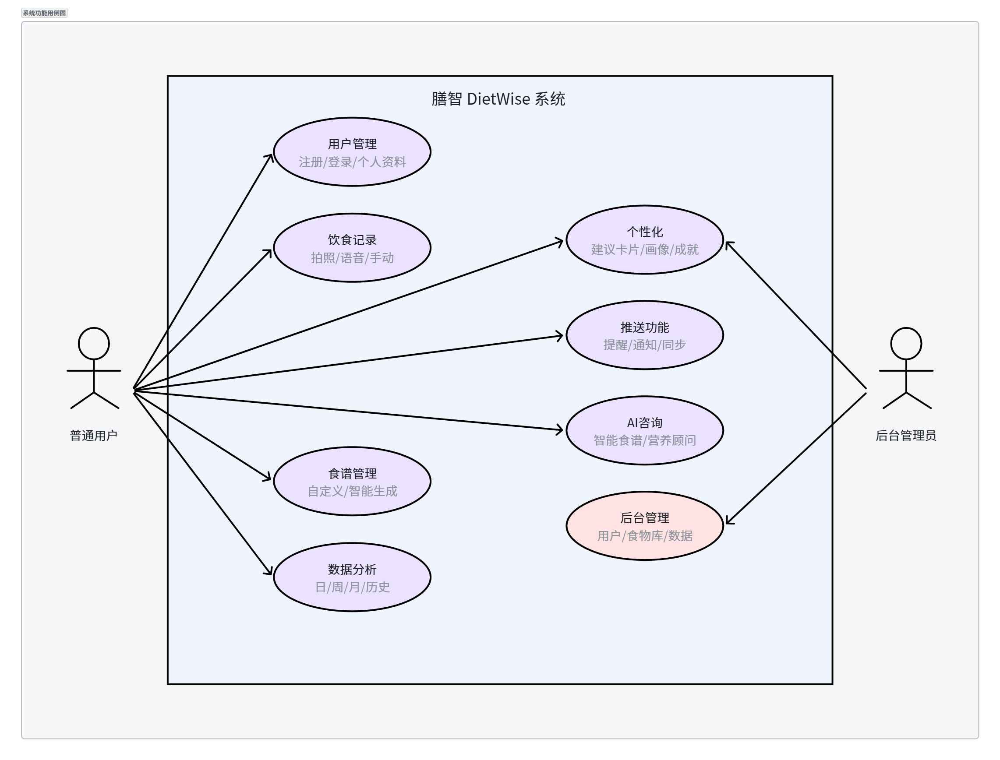
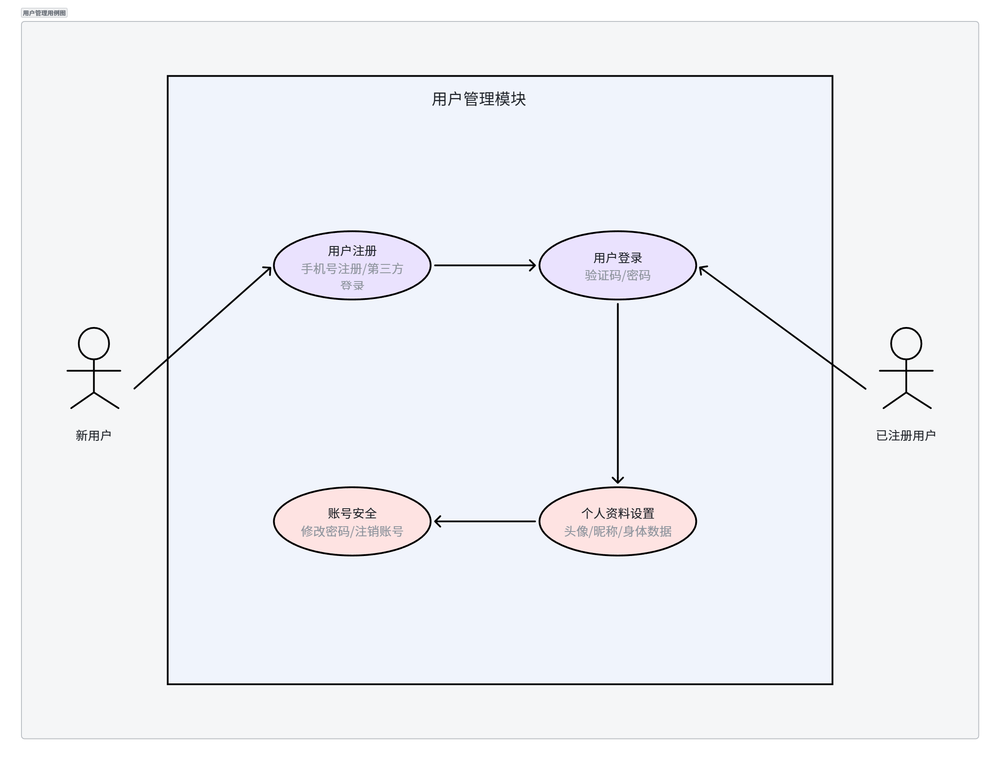
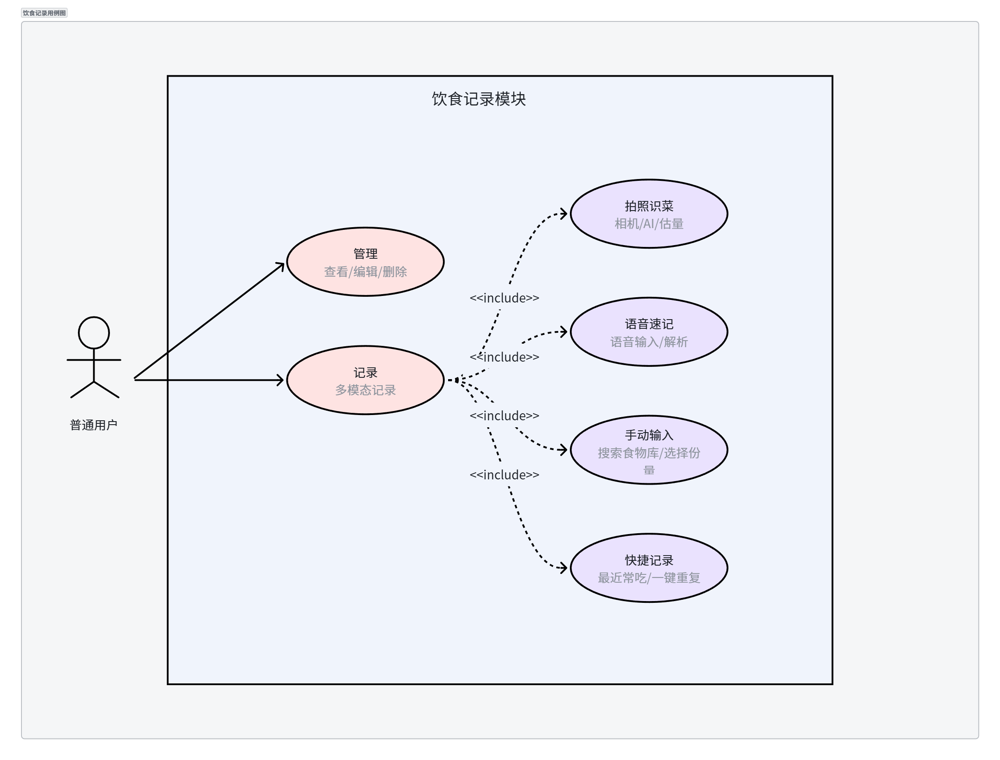
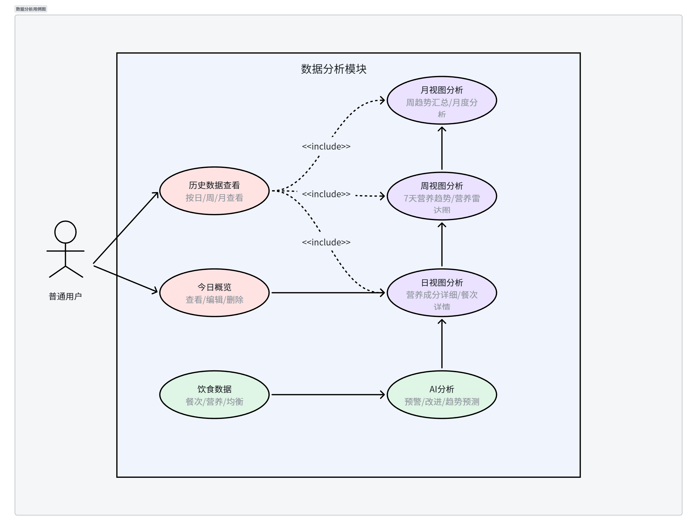
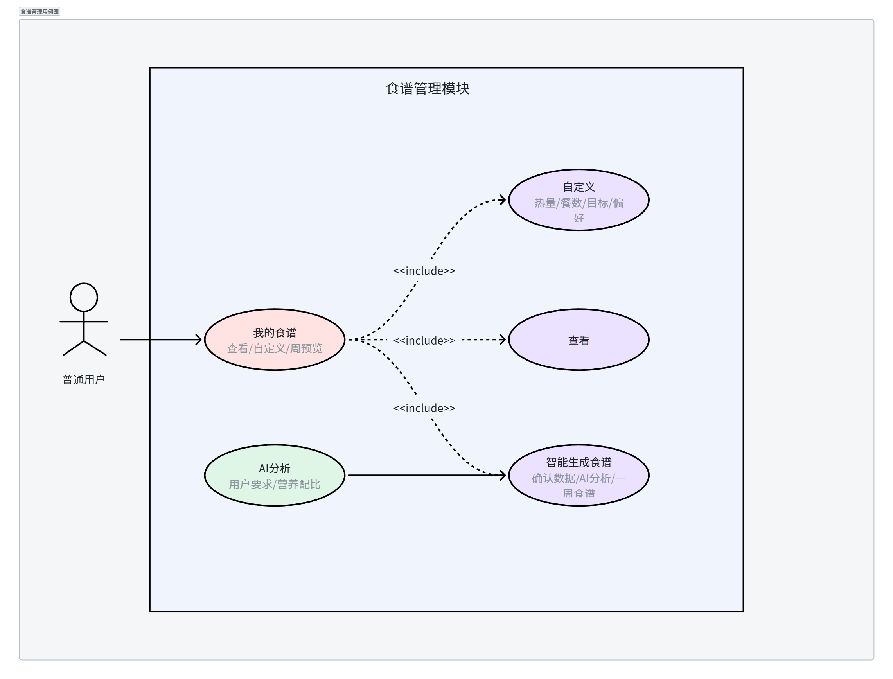
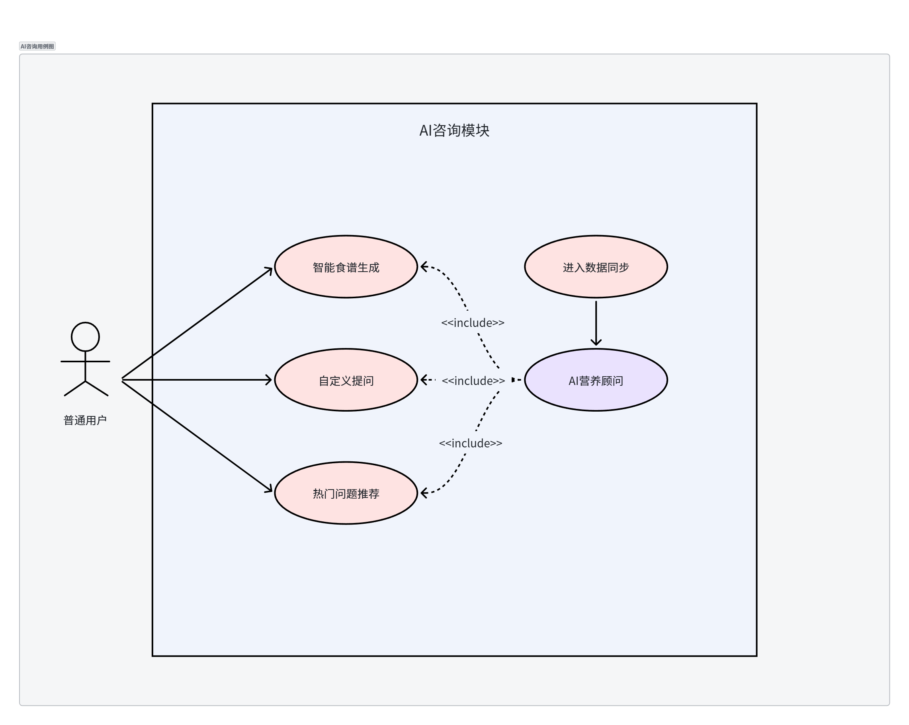
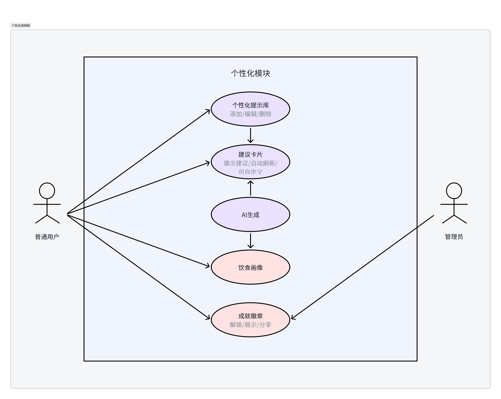
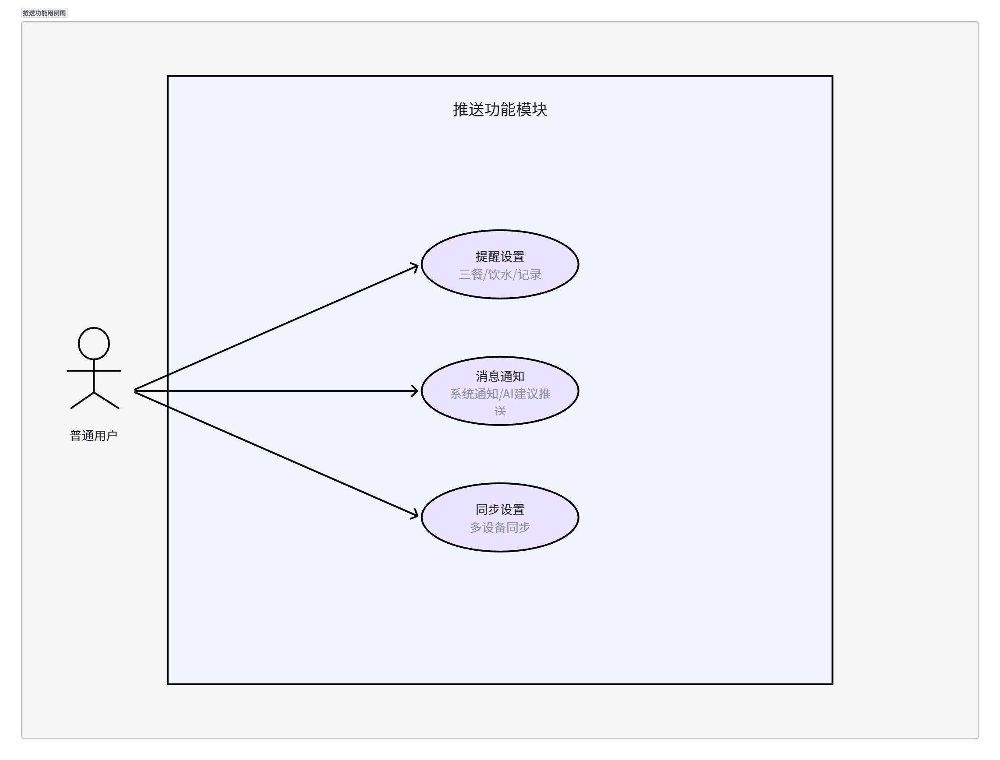
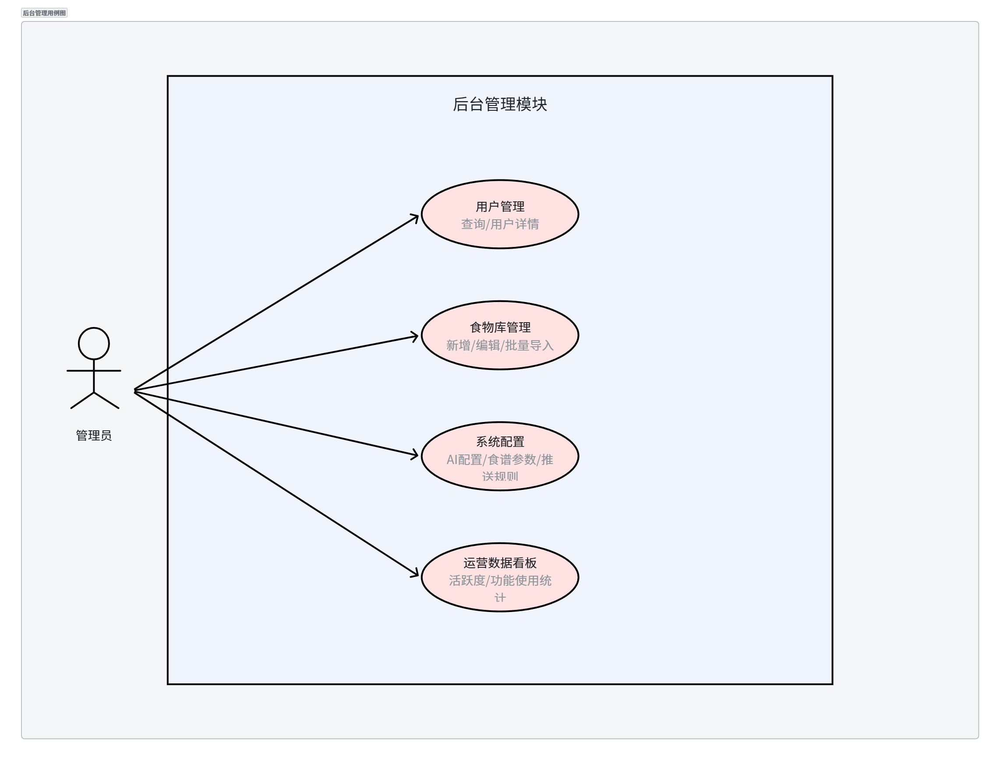

# 膳智 DietWise - 需求分析文档

## 目录

1. [项目概述](#1-项目概述)
2. [总体目标](#2-总体目标)
3. [用户角色分析](#3-用户角色分析)
4. [功能需求](#4-功能需求)
   - 4.1 [用例图](#41-用例图)
   - 4.2 [功能架构图](#42-功能架构图)
   - 4.3 [功能需求说明](#43-功能需求说明)
5. [非功能需求](#5-非功能需求)

---

## 1. 项目概述

### 1.1 项目背景

随着人们生活水平的提高和健康意识的增强，科学饮食管理成为现代人追求健康生活的重要组成部分。然而，传统的饮食记录方式存在以下痛点：

- **记录繁琐**：手动输入食物信息耗时耗力，难以坚持
- **分析困难**：缺乏专业的营养知识，无法科学评估饮食结构
- **建议单一**：市面上的饮食建议往往千篇一律，缺乏个性化
- **缺乏指导**：知道要健康饮食，但不知道具体怎么吃

### 1.2 项目简介

**膳智 DietWise** 是一款基于人工智能技术的智能饮食健康管理移动应用。通过AI图像识别、语音识别、自然语言处理等技术，帮助用户轻松记录饮食、科学分析营养、获取个性化饮食建议，培养健康的饮食习惯。

### 1.3 项目定位

- **产品类型**：移动健康应用（iOS & Android）
- **目标用户**：18-45岁关注健康饮食的人群
- **核心价值**：让饮食记录更简单，让健康饮食更科学
- **差异化优势**：AI驱动的个性化饮食方案 + 便捷的记录方式

---

## 2. 总体目标

### 2.1 业务目标

1. **降低饮食记录门槛**：通过AI技术实现一键记录，减少用户操作成本
2. **提供科学饮食指导**：基于用户数据生成个性化的营养建议
3. **培养健康饮食习惯**：通过长期的数据跟踪和反馈，帮助用户建立良好习惯
4. **打造智能健康助手**：成为用户日常饮食管理的贴身AI顾问

### 2.2 功能目标

| 目标类别 | 具体目标 |
|----------|----------|
| 记录便捷性 | 3秒内完成一次饮食记录 |
| 识别准确率 | AI识别食物名称和分量 |
| 个性化程度 | 千人千面的饮食建议 |

### 2.3 技术目标

- 支持100+并发用户访问
- AI服务响应时间 ≤ 5秒
- 系统可用性 ≥ 95%
- 数据安全加密存储

---

## 3. 用户角色分析

### 3.1 角色定义


### 3.2 角色说明

| 角色 | 描述 | 核心需求 |
|------|------|----------|
| 普通用户 | 使用App进行饮食记录的C端用户 | 记录饮食、查看分析、获取建议 |
| 后台管理员 | 管理系统的B端运营人员 | 用户管理、食物库维护、数据监控 |

---

## 4. 功能需求

### 4.1 用例图

#### 4.1.1 系统总体用例图



#### 4.1.2 用户管理模块用例图



#### 4.1.3 饮食记录模块用例图



#### 4.1.4 数据分析模块用例图



#### 4.1.5 食谱管理模块用例图



#### 4.1.6 AI咨询模块用例图



#### 4.1.7 个性化模块用例图



#### 4.1.8 推送功能模块用例图



#### 4.1.9 后台管理模块用例图



---

### 4.2 功能架构图

```
膳智 DietWise 功能架构
│
├── 1. 用户模块
│   ├── 1.1 注册/登录（手机号/第三方）
│   └── 1.2 个人资料（头像/昵称/身体数据）
│
├── 2. 饮食记录模块 ⭐核心
│   ├── 2.1 多模态记录（拍照/语音/手动）
│   ├── 2.2 快捷记录（最近常吃/一键重复）
│   └── 2.3 记录管理（查看/编辑/删除）
│
├── 3. 数据分析模块
│   ├── 3.1 今日概览（热量/营养/评分）
│   ├── 3.2 多维度分析（日/周/月/历史）
│   └── 3.3 AI分析建议（预警/改进/趋势）
│
├── 4. 食谱管理模块
│   ├── 4.1 我的食谱（查看/自定义/周预览）
│   ├── 4.2 智能生成食谱（AI生成一周食谱）
│   └── 4.3 食谱调整（替换/调分量/重生成）
│
├── 5. AI咨询模块
│   ├── 5.1 智能生成食谱入口
│   ├── 5.2 AI营养顾问（多轮对话/上下文感知）
│   └── 5.3 热门问题推荐
│
├── 6. 个性化模块
│   ├── 6.1 个人画像（AI标签/饮食分析）
│   ├── 6.2 成就徽章系统
│   ├── 6.3 AI建议卡片（首页展示）
│   └── 6.4 个性化提示库
│
├── 7. 推送功能模块
│   ├── 7.1 提醒设置（三餐/饮水/记录）
│   ├── 7.2 消息通知（系统/AI建议）
│   └── 7.3 同步设置（多设备同步）
│
└── 8. 后台管理模块（Web）
    ├── 8.1 用户管理
    ├── 8.2 食物库管理
    ├── 8.3 系统配置
    └── 8.4 运营数据看板
```

---

### 4.3 功能需求说明

#### 4.3.1 用户模块

| 编号 | 需求名称 | 优先级 | 简要说明 |
|------|----------|--------|----------|
| FR-001 | 用户注册与登录 | 高 | 手机号/验证码/第三方登录 |
| FR-002 | 个人资料设置 | 高 | 头像、昵称、身体数据（身高/体重/年龄/性别） |
| FR-003 | 账号安全 | 中 | 修改密码、绑定手机、注销账号 |

#### 4.3.2 饮食记录模块

| 编号 | 需求名称 | 优先级 | 简要说明 |
|------|----------|--------|----------|
| FR-004 | 拍照识菜 | 高 | AI图像识别菜品、分量、营养成分 |
| FR-005 | 语音速记 | 高 | 语音识别转文字，自动解析食物信息 |
| FR-006 | 手动输入 | 高 | 搜索食物库，手动选择食物和分量 |
| FR-007 | 快捷记录 | 中 | 最近常吃列表、一键重复记录 |
| FR-008 | 记录管理 | 高 | 查看、编辑、删除历史饮食记录 |

#### 4.3.3 数据分析模块

| 编号 | 需求名称 | 优先级 | 简要说明 |
|------|----------|--------|----------|
| FR-009 | 今日概览 | 高 | 热量摄入环形图、营养进度条、健康评分 |
| FR-010 | 日视图分析 | 高 | 营养成分详细分析、餐次详情 |
| FR-011 | 周视图分析 | 高 | 7天热量趋势、营养均衡雷达图 |
| FR-012 | 月视图分析 | 中 | 周趋势汇总、月度营养分析 |
| FR-013 | 历史数据查看 | 中 | 按日/周/月维度查看历史数据 |

#### 4.3.4 食谱管理模块

| 编号 | 需求名称 | 优先级 | 简要说明 |
|------|----------|--------|----------|
| FR-014 | 我的食谱 | 高 | 当前食谱展示、自定义设置、周食谱预览 |
| FR-015 | 智能生成食谱 | 高 | AI根据身体数据、目标、偏好生成一周食谱 |
| FR-016 | 食谱调整 | 中 | 替换菜品、调整分量、重新生成 |

#### 4.3.5 AI咨询模块

| 编号 | 需求名称 | 优先级 | 简要说明 |
|------|----------|--------|----------|
| FR-017 | AI营养顾问 | 高 | 多轮对话、上下文感知（同步今日饮食数据） |
| FR-018 | 热门问题推荐 | 低 | 预设常见饮食问题快捷入口 |

#### 4.3.6 个性化模块

| 编号 | 需求名称 | 优先级 | 简要说明 |
|------|----------|--------|----------|
| FR-019 | AI建议卡片 | 中 | 首页展示AI生成的个性化饮食建议，支持刷新 |
| FR-020 | 个性化提示库 | 中 | 添加/编辑/删除自定义提示内容 |
| FR-021 | 饮食画像 | 中 | AI生成饮食标签（早餐战士/低碳先锋等）、个性化分析 |
| FR-022 | 成就徽章系统 | 低 | 连续记录、营养均衡等徽章奖励 |

#### 4.3.7 推送功能模块

| 编号 | 需求名称 | 优先级 | 简要说明 |
|------|----------|--------|----------|
| FR-023 | 提醒设置 | 中 | 三餐/饮水/记录/睡前提醒设置 |
| FR-024 | 消息通知 | 低 | 系统通知、AI建议推送、成就解锁通知 |
| FR-025 | 数据同步 | 中 | 云端备份、多设备同步、离线模式 |

#### 4.3.8 后台管理模块

| 编号 | 需求名称 | 优先级 | 简要说明 |
|------|----------|--------|----------|
| FR-026 | 用户管理 | 高 | 查询用户、查看详情 |
| FR-027 | 食物库管理 | 高 | 新增/编辑/批量导入食物数据 |
| FR-028 | 系统配置 | 中 | AI配置、食谱参数、推送规则 |
| FR-029 | 运营数据看板 | 低 | 用户活跃度、功能使用统计 |

---

## 5. 非功能需求

### 5.1 性能需求

| 编号 | 需求描述 | 目标值 | 测试方法 |
|------|----------|--------|----------|
| NFR-001 | 页面加载时间 | ≤ 3秒 | Chrome Lighthouse |
| NFR-002 | AI识别响应时间 | ≤ 5秒 | 手动计时 |
| NFR-003 | AI对话响应时间 | ≤ 3秒 | 手动计时 |
| NFR-004 | 数据查询响应时间 | ≤ 1秒 | Network面板 |
| NFR-005 | 并发用户数 | 100+ | Apache Bench |
| NFR-006 | 系统可用性 | ≥ 95% | 7天观察 |

### 5.2 安全需求

| 编号 | 需求描述 | 实现方式 |
|------|----------|----------|
| NFR-007 | 密码加密存储 | BCrypt哈希 |
| NFR-008 | 传输加密 | HTTPS协议 |
| NFR-009 | 接口鉴权 | JWT Token |
| NFR-010 | SQL注入防护 | ORM参数化查询 |

### 5.3 可用性需求

| 编号 | 需求描述 | 验证方式 |
|------|----------|----------|
| NFR-011 | 适配主流移动设备 | 多机型测试 |
| NFR-012 | 新手引导 | 首次启动显示 |
| NFR-013 | 操作反馈 | 视觉/震动反馈 |
| NFR-014 | 错误提示友好 | 明确错误信息 |

### 5.4 可维护性需求

| 编号 | 需求描述 | 说明 |
|------|----------|------|
| NFR-015 | 代码注释完整 | 核心函数中文注释 |
| NFR-016 | 接口文档 | Swagger生成 |
| NFR-017 | 数据库版本管理 | TypeORM Migration |
| NFR-018 | 日志记录 | Winston记录错误日志 |

---

*文档版本：v1.0*  
*更新日期：2026-03-10*
